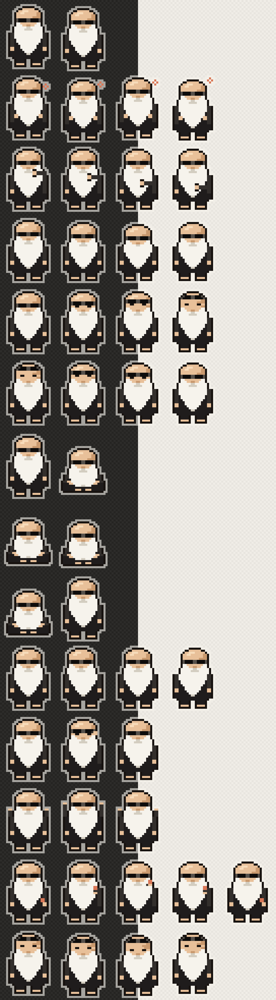

# rubin-buddy

An 8-bit desktop buddy — bald dome, shades, enormous beard, all black — who sits
on top of your windows, reacts to what Claude Code is doing, and occasionally
says something worth hearing.

Rick-Rubin-inspired homage. Not a likeness anyone would mistake for the real
thing, and the things he says are written for the character, not quoted from him.



## Install

One line, macOS:

```bash
curl -fsSL https://raw.githubusercontent.com/otniel-bit/rubin-buddy/main/install.sh | sh
```

He appears bottom-right, adds a menu bar icon, and starts at login from then on.

**Requirements:** macOS and the Xcode Command Line Tools. If you don't have them:

```bash
xcode-select --install
```

Nothing else — no Homebrew, no Node, no npm. The installer builds from source on
your machine, which is deliberate: a downloaded unsigned binary gets quarantined
by Gatekeeper and needs a right-click-open dance, while something you compiled
locally just runs. It also means you can read exactly what you're installing
before you run it.

Everything lands in `~/.rubin-buddy/`. Nothing is installed system-wide and
nothing needs `sudo`.

### Make him follow Claude Code

The installer asks — say yes. Already installed? Click the menu bar head →
**Follow Claude Code**. Either way it's the same thing underneath:

```bash
~/.rubin-buddy/hooks.sh
```

That merges six hooks into `~/.claude/settings.json`, keeping whatever's already
in there. Declining at install is remembered, so updates never nag. Open a new
Claude Code session and he'll start reacting:

| Claude Code event | What he does |
| --- | --- |
| You send a prompt | Both hands on the beard, a Claude-orange spark drifting up |
| A tool starts | One hand works down the beard — he's in the material |
| Claude needs you | Pushes his shades up onto his crown and holds your eye |
| Claude finishes | One slow nod, then back to breathing |

Undo it any time with `~/.rubin-buddy/hooks.sh --remove`.

## Menu bar

The bald silhouette with the shades. Everything lives there:

| Item | |
| --- | --- |
| Show / Hide Rick | Toggle without quitting |
| **Bring Him Back** | Drops him bottom-right on the main screen, shades up. The "I've lost him" button. |
| Size | Tiny · Small · Medium · Large |
| Chatter | Silent · Quiet (5–15 min) · Normal (2.5–7 min) · Talkative (45 s–2 min) |
| Pose | Play any animation directly |
| Say Something | A line on demand |
| Take a Breath | A guided minute — he sits, the bubble paces you |
| Follow Claude Code | Wires / unwires the hooks — same merge as `hooks.sh` |
| Start at Login | Writes / removes the launchd agent |
| Check for Updates · Auto-Update | See below |
| Quit Rick | |

Size, chatter and auto-update persist across restarts.

You can also **drag** him anywhere (his position is remembered), **click** him
for a nod and a line, or **right-click** him for the same menu.

## Updating

He checks for a new version 45 seconds after login and every 6 hours after that,
and updates himself when there is one — so if you got this from a friend, you get
their improvements automatically. Turn it off under **Auto-Update**, or force a
check with **Check for Updates**.

Manually:

```bash
~/.rubin-buddy/update.sh
```

Updating re-runs the installer, which **preserves an edited `lines.txt`** — if
you've customised what he says, your version stays and the new default is
written alongside as `lines.txt.new`. It knows the difference by remembering the
hash of whatever it shipped last time.

### Two things the updater got wrong first, in case you build one

**Never `cp` over a running executable.** The first version of the updater killed
him every single time it worked — `SIGKILL`, `Code Signature Invalid`,
`Taskgated Invalid Signature`. macOS validates code pages against the binary's
signature (ad-hoc counts) as it faults them in, so changing the bytes underneath
a live process invalidates pages it hasn't read yet. `install.sh` now writes to a
temp name and `mv`s it into place: `rename()` only swaps the directory entry, so
a running copy keeps its original inode and stays valid.

**`raw.githubusercontent.com` caches for about five minutes.** Fine for a
six-hourly poll, but it made a manual **Check for Updates** report the previous
version right after a release, which looks broken. The version check uses the
contents API with `Accept: application/vnd.github.raw` instead — uncached, and
60 requests/hour unauthenticated is far more than this needs — falling back to
raw if the API is unreachable.

He also holds an advisory `flock` on `~/.rubin-buddy/.lock`, so a second launch
prints `already running` and exits. Two of him would fight over the same state
file and saved position. The kernel drops the lock on exit however the process
goes, so unlike a pidfile a crash can't leave a stale one behind.

## What he says

Around 270 lines in `~/.rubin-buddy/lines.txt`, one per line, `#` for comments,
grouped into two dozen themes (the file is the source of truth for the count). He re-reads the file every time he speaks, so **edits land
live** — no rebuild, no restart.

He deals them from a **shuffled deck** rather than picking independently, so every line plays before any repeats. Independent picking gives a first repeat after
roughly 20 draws — under two hours on the default timing — which
would have wasted most of the deck.

### He speaks to the moment

The theme headers in `lines.txt` aren't just organization — the moment picks the
theme:

| Moment | Theme he draws from |
| --- | --- |
| A turn finishes (sometimes, 1 in 3) | *Finishing* — "It'll never feel finished. Ship it." |
| Claude has been waiting on you 3+ minutes | *Noticing* / *Taste* — you're the decision now |
| Two hours of unbroken work | *Stepping away* — "Go for a walk. It'll keep." |
| ~90 minutes at the machine without a real break | *The world* — "The screen will wait. The sunset won't." |
| A single task runs past ~10 minutes | He sits down and keeps watch; when it finally lands, the Finishing line is guaranteed |
| Your first arrival of the day (after 4+ hours away) | *Beginnings* / *Practice* — "Begin badly. Begin anyway." |

Contextual lines share a 15-minute cooldown so he never gets chatty about it,
respect Silent mode, and fall back to the whole deck if you rename the groups.
Renaming or reordering groups in `lines.txt` is safe; the parser reads whatever
headers are there. (`RUBIN_CTX_FAST=1` compresses all the timings to seconds for
testing.)

### On the lines

They're **original phrasings**, not quotations. Pasting someone's copyrighted
text into a file that then presents it as an unattributed character line isn't a
thing to ship. But they aren't invented from nothing either — they're written
from his documented ideas:

- reduction over addition — early in his career he credited himself on records
  as having *reduced* them, not produced them
- getting the point across with the least information that still lands
- removing until the identity of the thing is challenged
- creativity as noticing rather than inventing
- taste over technique — he's said plainly he has no technical ability
- leaving the fewest fingerprints; state what you see and let the artist decide
- stepping away as part of the work, not a break from it
- beginner's mind, keeping useful mistakes, work that divides over work that bores

**Sources:** [60 Minutes](https://www.cbsnews.com/news/rick-rubin-anderson-cooper-60-minutes-interview-2023-01-15/) ·
[Conversations with Tyler](https://conversationswithtyler.com/episodes/rick-rubin/) ·
[The Tim Ferriss Show #649](https://tim.blog/2023/01/16/rick-rubin-2-transcript/) ·
[On Being](https://onbeing.org/programs/rick-rubin-magic-everyday-mystery-and-getting-creative/) ·
[Complex](https://www.complex.com/music/a/eric-skelton/rick-rubin-interview-the-creative-act) ·
[Ten lessons, Ian Sanders](https://www.iansanders.com/blog/ten-lessons-on-the-creative-process-from-rick-rubin) ·
[Reduce until the identity is challenged](https://blakecrosley.com/blog/design-philosophy-rick-rubin)

## Something wrong?

**Report a Problem** in his menu opens a GitHub issue pre-filled with your
version and macOS build. If he crashed or vanished, attach
`~/Library/Logs/rubin-buddy.log` — it contains only his own errors, nothing
personal. Or file directly: [issues](https://github.com/otniel-bit/rubin-buddy/issues),
or email [gonzalezot16@gmail.com](mailto:gonzalezot16@gmail.com) if GitHub isn't your thing.

## Uninstall

```bash
~/.rubin-buddy/uninstall.sh
```

Removes the app, the launch agent, the log, his hooks in
`~/.claude/settings.json` (only his — the rest of the file is preserved, and
the pre-Rick original is backed up as `settings.json.rubin-bak`), and his
saved preferences.

---

# Working on him

Only needed if you want to change the sprite or the code. Node is required here
(it isn't for installing) because it generates the frames.

```bash
git clone https://github.com/otniel-bit/rubin-buddy.git
cd rubin-buddy
node build.js && swiftc -O Buddy.swift -o buddy
./buddy
```

`frames/` is committed on purpose, so installing needs only `swiftc` and never
Node.

Running from a checkout, he detects he isn't the managed install and skips
auto-updating — the menu shows "dev build" and tells you to `git pull` instead.

### Shipping a change to everyone

**Commit and push. That's the whole process.**

The `Release` workflow does the rest: it regenerates `frames/` from `sprite.js`,
bumps the patch `VERSION`, and commits both. Installed copies notice within six
hours and reinstall themselves. Two details make it safe:

- It only runs for pushes that touch the app — `Buddy.swift`, `sprite.js`,
  `frames/`, `lines.txt`, the shell scripts. A README or `site/` change deploys
  the website but doesn't restart anyone's buddy to deliver a typo fix.
- It ignores its own pushes (`github.actor != 'github-actions[bot]'`), which is
  what stops the release commit triggering another release forever.

So `VERSION` is not something to edit by hand. If you do bump it manually, CI
will bump it again on top — harmless, just a wasted release.

The landing page at [rick-buddy.netlify.app](https://rick-buddy.netlify.app) is
`site/index.html`, deployed by Netlify on every push to `main`. It's one
self-contained file: the sprite is inlined as base64 and there are no external
requests.

**Stop him before recompiling** (`pkill -x buddy`) — `swiftc -o buddy` writes in
place, and overwriting a live executable gets it killed for an invalid code
signature. `install.sh` avoids this with an atomic rename; a bare `swiftc` does
not. `pkill` also releases the single-instance lock.

Useful while working on him:

```bash
./buddy --version
./buddy --help
RUBIN_DEBUG=1 RUBIN_UPDATE_DELAY=5 ./buddy    # log animation + update decisions
```

## Layout

| File | What it is |
| --- | --- |
| `sprite.js` | The design. Pixel rows as strings, palette, poses, animations. |
| `build.js` | Writes `frames/*.png`, `frames/manifest.json`, the menu bar icon, and `preview.png`. |
| `png.js` | Zero-dependency PNG encoder. |
| `Buddy.swift` | The app: window, state watching, speech bubble, menu bar, updater. |
| `install.sh` | The one-liner. Also the updater — it's idempotent. |
| `update.sh` · `hooks.sh` | Thin wrappers around the above. |
| `state.sh` | What the Claude Code hooks call. Atomic one-word write. |
| `lines.txt` | What he says. |
| `VERSION` | Bump this to ship an update. |

## How the pieces talk

He watches a one-word state file — `~/.rubin-buddy/state` — and plays whatever
animation is named in it. `state.sh` writes it, the hooks call `state.sh`. The
hooks are all `async: true` so they never block Claude Code, and `state.sh` exits
0 unconditionally. A desktop pet must never be why a hook fails.

Drive him by hand with any animation name:

```bash
~/.rubin-buddy/state.sh glasses
```

`idle` · `think` · `stroke` · `nod` · `glasses` · `unglasses` · `look` · `sitdown` · `meditate` · `standup` · `glance` · `adjust` · `stretch` · `tea` — plus two words that aren't animations: `breathe` starts a guided breath, and `say` borrows his voice:

```bash
~/.rubin-buddy/state.sh say "Deploy is green."
```

One bubble, once, capped at 140 characters — the quietest notification endpoint
on your Mac. Anything you can script can speak through him.

### Idle fidgets

Reacting to Claude Code turned out to be the smaller half of looking alive —
between turns he sat in a two-frame bob for minutes, which is most of what
anyone actually saw. So idleness has a life of its own now: he strokes the beard, sits
with a thought, pushes his shades up and looks around, glances about the room,
adjusts his shades, stretches, or takes a slow sip of tea — never the same
gesture twice running. Coming to rest after work invites a gesture within
seconds; deeper quiet spaces them out to every half-minute or so. A real Claude Code event
cancels any fidget instantly and pushes the next one out, so fidgets only ever
happen in genuine quiet. (`RUBIN_CTX_FAST=1` compresses the timing for testing.)

The `nod` was also slowed from 0.6s to 1.3s — at the old tempo the "Claude
finished" gesture played once and nobody ever saw it.

### Long tasks, and late nights

When Claude works one task past ~10 minutes, he stops stroking the beard and
sits down to keep watch — patience reads better than manic looping. More events
from the same task don't stand him up; the Stop does, and a long run's ending
always earns its Finishing line. Past 11pm his idle becomes the seated pose
too: he sits with you, stands when something happens, settles back down.

### He meditates

When you've been away from the machine ~8 minutes, he sits down cross-legged
and breathes slower than usual — his own practice, not a reaction to you. When
you come back he just gets up. A sit you start yourself (Pose menu, or
`state.sh meditate`) is yours to end; only the ones he started on his own end
when you return.

### Take a Breath

One menu item. He sits, and the bubble paces four slow rounds — *In… hold…
out…* — about a minute, then he stands. No streaks, no history, no reminder.
Clicking him mid-breath means "enough"; he stands, nothing more. Scriptable via
`~/.rubin-buddy/state.sh breathe`.

### Mornings, and what he last said

Your first activity of each day earns one line, leaning toward *Beginnings* and
*Practice*. And if you catch a bubble vanishing and wonder what it was, the
menu shows `He said: "…"` — click it to copy the line.

### Shade transitions

Each animation declares where the shades end up (`shades: 'up' | 'down'`), and
two are marked `transition: true` with a `from`: `glasses` (down→up) and
`unglasses` (up→down). Request an animation whose shade position doesn't match
where they are, and the player inserts the matching gesture first and queues your
request behind it — so he never hard-cuts from bare-eyed to shaded. Requesting a
transition that's already satisfied skips to where it would have landed instead of
bouncing. There are no hardcoded transitions in the Swift; it all comes from the
manifest.

## Environment knobs

| Variable | Default | What it does |
| --- | --- | --- |
| `RUBIN_SCALE` | `2.5` | Logical scale, decimals fine (snapped to device pixels) |
| `RUBIN_CHATTER` | `150-420` | Seconds of quiet between unprompted lines |
| `RUBIN_LINES` | `lines.txt` beside the binary | Where to read his lines from |
| `RUBIN_STATE` | `~/.rubin-buddy/state` | State file to watch |
| `RUBIN_FRAMES` | `frames/` beside the binary | Frame directory |
| `RUBIN_DEBUG` | off | `1` logs every animation change to stderr |
| `RUBIN_UPDATE_DELAY` | `45` | Seconds after launch before the first update check |
| `RUBIN_CTX_FAST` | off | `1` compresses every contextual timer to seconds, for testing |

`RUBIN_SCALE` and `RUBIN_CHATTER` given at launch override the remembered menu
choice for that run.

## Drawing him

Rows live in `sprite.js` as strings of palette characters (`k` outline, `s` skin,
`w` beard, `b` tee, `l` lens…). `buildRows()` asserts every row is exactly 24
characters and every character is a known colour, so a miscounted run fails the
build instead of quietly shearing the sprite. Rows are assembled from
`c('w', 14)`-style runs rather than typed out literally, for the same reason.
This caught three real mistakes while drawing him.

Five constraints worth keeping if you redraw him:

1. **Beard over dome, heavily.** 4 rows of scalp against 16 rows of beard. Even
   proportions read as a garden gnome.
2. **Don't let the beard taper cleanly from the shoulders** — a perfect triangle
   turns the black tee into tuxedo lapels.
3. **Arms one shade lighter than the torso** (`n` vs `b`), or hands read as tan
   squares floating beside him.
4. **A hand on the beard needs its arm.** A bare 2×2 skin block on all that white
   is a smudge; the dark sleeve running back to the shoulder is what actually
   reads. See `strokePatch()`.
5. **Head rows 4–8 share a 12px interior**, which is what lets the shades slide up
   the face with no special-casing. Row 3 is only 10 wide, so the crown has its
   own narrower band — and mixing the two widths is what makes the pushed-up
   shades read as tilted rather than flat.

### The rim light

His tee is `#1f1c1c` and his outline `#17120f`, which on a dark desktop left only
the beard, face and hands reading — the body dissolved into the wallpaper.
`withRim()` pads the grid by a pixel, then lights every transparent pixel
touching the silhouette.

- **The rim is translucent** (`#f6f3ec` at ~61%). Against a dark desktop it lifts
  him off the background; against a light one it all but disappears. An opaque rim
  looks fine on dark and like a sticker outline on white.
- **8-connected, not 4.** Orthogonal-only leaves gaps on exactly the sloped edges
  — the beard taper, the dome — that most need separating.

It's applied in `build.js` as a post-process, so every animation gets it for free
and no row strings have to account for the extra pixel.

### Sizing

`scale` is a decimal, but each sprite pixel is snapped to a whole number of
**device** pixels before the window is sized — otherwise some sprite pixels land
on 4 device pixels and their neighbours on 5, which reads as a wobble along every
straight edge. So the same `scale` gives 65×85 on a 2× display and 78×102 on a 1×
one, and both are pixel-exact.

## The mixed-DPI crash, and why the anchor matters

Dragging him between a 2× laptop display and a 1× external monitor used to kill
him outright — `SIGSEGV`, stack exhausted. Worth writing down, because the fix
looks arbitrary until you see the loop.

The crash report's stack was the whole story: `mouseDragged` → `setFrameOrigin` →
`_updateSettingsSendingScreenChangeNotificationToScreen:` →
`NSWindow.didChangeScreenNotification` → `screenChanged()` → `setFrame` → the same
notification again, six nested copies before the report truncated.

`screenChanged()` resizes the window to re-snap the sprite pixels. Resizing
changes which display the window *most overlaps*, which is what `window.screen`
reports, which is what the old code fed back into the size calculation:

| Display | `backingScaleFactor` | pixel at scale 2.5 |
| --- | --- | --- |
| Built-in Retina | 2.0 | 2.5 |
| 1× external | 1.0 | 3.0 |

Each pass picked the *other* display's value, resized, and re-fired. It only
happened while straddling the boundary — exactly what dragging between monitors
does.

Three changes:

1. **A reentrancy guard** (`adjustingScale`) so the resize can't re-enter the
   handler that triggered it.
2. **A stable anchor.** The scale comes from the display under the window's
   *origin*, not `window.screen`. `setFrame` keeps the origin fixed, so resizing
   can't change the answer — a fixed point instead of a feedback loop.
3. **The same anchor at startup.** `init` used `NSScreen.main`, so he'd come up at
   the laptop's scale even when parked on the external display.

Dragging him fully off every display is refused now too.

## Known rough edges

- Every Claude Code session writes to the same state file, so with several
  sessions running he reflects whichever one moved last.
- If the display he's parked on is unplugged he's hauled back to the main screen's
  bottom-right, which loses his position. Better than being stranded, and "Bring
  Him Back" is there either way.
- The updater trusts this repo. That's inherent to any auto-updater — whoever
  controls the repo controls what your machine builds. `install.sh` is short and
  worth reading, and **Auto-Update** turns it off.
